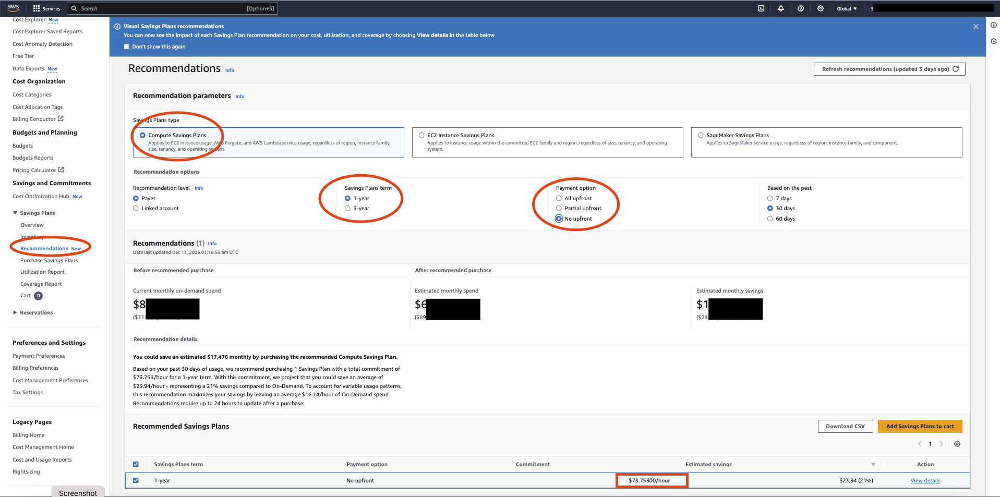

### AWS Savings Plans Overview

AWS Savings Plans are a pricing model offered by Amazon Web Services (AWS) to help customers save money on their cloud computing costs. 
They provide a flexible and cost-effective way to purchase compute power for a consistent amount of usage (measured in $/hr) for 
a 1 or 3-year term, in exchange for a significant discount compared to On-Demand pricing.

If you have multiple AWS accounts organized by AWS Organizations, the account which consolidates billing of all AWS accounts 
is the managed AWS account which is typically the root account.    

**To get started,** 
  - Login to your managed AWS Account as Admin and browse to AWS Cost Explorer to view your recommended Savings Plans commitment, 
    - Refresh Savings Plans recommendations, 
    - Purchase Savings Plans, 
    - Manage your Savings Plans, and 
    - View your historical AWS usage.    
    
These recommendations make it easy for you to know the optimal Savings Plans commitment level for you. 
  - You can customize the recommendation to meet your needs and then purchase your Savings Plan. 
  - You can pay for your commitment using All upfront, Partial upfront, or No upfront payment options. Usual practice is to use No upfront payment option as this gives us the flexibility to pay for the commitment monthly instead of upfront.    

Below is the screenshot of Cost Explorer   

   

As you can see there are 3 types of Savings Plans but only 2 are related to most of the use cases :   
  - Compute Savings Plans   
  - EC2 Instance Savings Plans   

## Compute Savings Plans   

Compute Savings Plans provide the most flexibility and discounted prices of On-Demand rates. 
These plans automatically apply to your EC2 instance usage, regardless of 
  - Instance family(m5, c5, etc.)
  - Instance sizes (c5.large, c5.xlarge, etc.)
  - AWS Region (us-east-1, us-east-2, etc.)
  - Operating system (for example, Windows, Linux, etc.) 
  - Tenancy (for example, Dedicated, default, Dedicated Host)    

## EC2 Instance Savings Plans  

  - EC2 Instance Savings plans provide more savings than compute savings plan of On-Demand rates, in exchange for a commitment 
to a specific instance family in a chosen AWS Region (for example, M5 in Virginia). 
  - With an EC2 Instance Savings Plan, you can change your instance size within the instance family. For example from m5.xlarge to m5.2xlarge, but you cannot change 
from m5 to c5 or m5 to graviton instances. 
  - This plan is an upgrade in flexibility compared to another AWS EC2 cost saving feature called Reserved Instance (RI) which require a commitment to a specific instance type in a particular region for a 
term of 1 or 3 years.   

## Tips when purchasing a savings plan:     

  - Look at your usage over the last 6 months from AWS Cost Explorer for each region and comparing with the kind of projects you have in pipeline 
for the next 6 - 12 months you should be able to estimate the total EC2 compute usage for the next 12 months. 
  - Once you have a ballpark number for total EC2 usage, you need to make sure atleast 80-90% of this usage is covered with Savings Plans leaving other 20-10% room for any optimizations you make. 
  - Ideally this can be upto 90-100% but getting 90-100% accuracy is being quite difficult in utilization of savings plans given your dynamic usage patterns and the kind of other cost optimization plans you may have. 
(eg: Moving from x86 to ARM based EC2 instances)   

  - Purchase multiple small $/hr savings plans with different start dates spread across the year instead of few large $/hr savings plans. This gives you the flexibility to adjust the savings plans spend because of available time-gaps between their expiry dates. 
  - For eg: When you compare 1 savings plans with $150/hr vs 10 savings plans with $30/hr starting at different start dates throughout the year, you can squeeze in more than $150/hr for a given quarter when the spend is too high and if ever the spend gets low you don't have to renew the 
upcoming savings plans which are due. 
  - This gets much more clear when you look at the “Utilization Report” on the side nav of Savings Plans page.   

