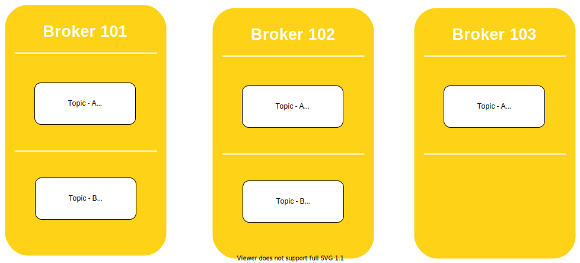
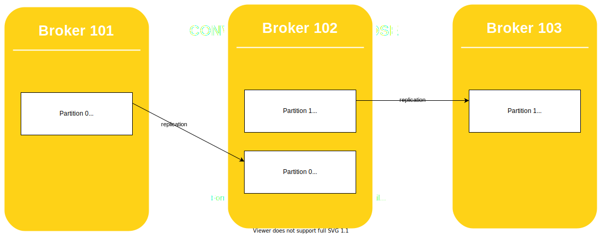

### Brokers
- A Kafka cluster is composed of multiple brokers (servers)
- Each broker is identified with its ID (integer)
- Each broker contains certain topic partitions
- After connecting to any broker (called a bootstrap broker), you will be connected to the entire cluster
- A good number to get started is 3 brokers, but some big clusters have over 100 brokers.
- You can choose to number brokers starting at 100 (arbitrary)

```
---------------       ---------------      --------------
|             |       |             |      |            |
| Broker 101  |       | Broker 102  |      | Broker 103 |
|             |       |             |      |            |
---------------       ---------------      --------------
```

### Brokers and Topics

- Example of Topic-A with 3 partitions
- Example of Topic-B with 2 partitions



- Note: Data is distributed and Broker 103 doesn't have any Topic B data


### Concept of Leader for a Partition

- At any time only ONE broker can be a leader for a given partition
- Only that leader can receive and serve data for a partition
- The other brokers will synchronize the data
- Therefore each partition has one leader and multiple ISR (in-sync replica)


