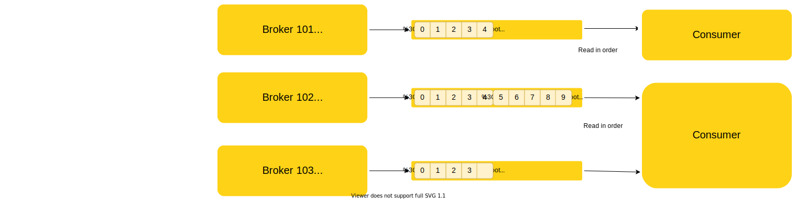
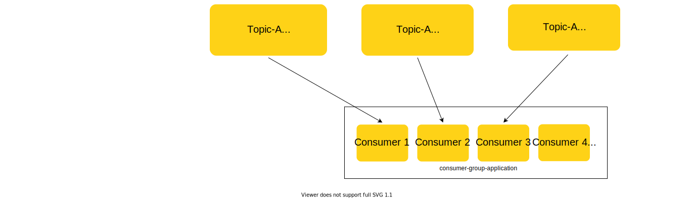

### Consumers    

- Consumers read data from a topic (identified by name)       
- Consumers know which broker to read from         
- In case of broker failures, consumes know how to recover      
- Data is read in order within each partitions.    

    

### Consumer Groups        

- Consumers read data in consumer groups    
- Each consumer within a group reads from exclusive partitions    
- If you have more consumers than partitions, some consumers will be inactive    

Note: Consumers will automatically use a GroupCoordinator and a ConsumerCoordinator 
to assign a consumer to a partition.    

### What if too many Consumers?    

- If you have more consumers than partitions, some consumers will be inactive    

