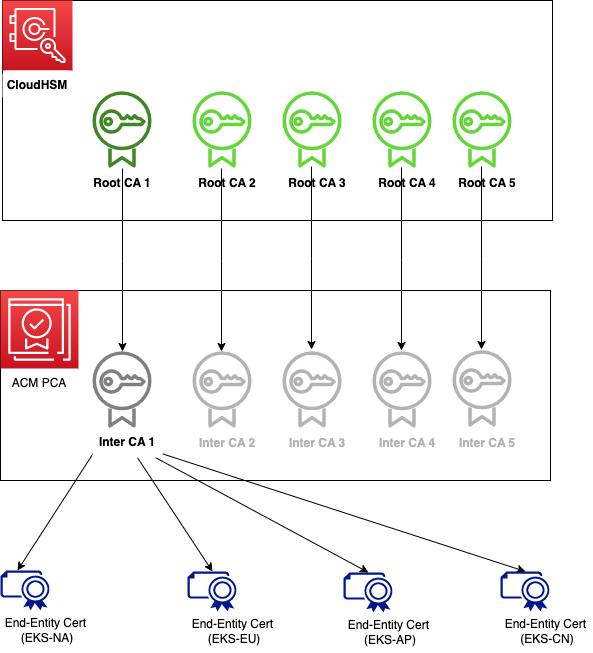

### How to get access to private key of the root certificate when using AWS Private CA?

AWS Private CA enables you to create a private CA (Certificate Authority) hierarchy to issue and revoke digital certificates 
for secure communication and authentication purposes. With AWS Private CA : 

  - You can establish a private CA hierarchy, which enables you to maintain control over your digital infrastructure's security 
  and trustworthiness    
  - It eliminates the reliance on public CAs and reduces the risk of certificate-related attacks.   
  - It provides APIs and mechanisms for customers to manage subordinate certificates - issuing, renewing, and revoking 
certificates. 
  - Allows customers to maintain control over their certificate lifecycle management while benefiting from the 
managed infrastructure and scalability.   

While it is so beneficial as described above one key caveat with AWS Private CA is it does not provide access to the private key 
of the root certificate for security reasons. This approach aligns with industry best practices and helps protect the integrity 
and trustworthiness of the certificate authority infrastructure.   

But there may be specific scenarios where a customer might require access to the private key of the root certificate. For eg:   
  - Some legacy systems or external services may have specific requirements or limitations that necessitate direct access to 
  the private key   
  -  In certain highly regulated industries, organizations may have unique compliance requirements that mandate direct control 
  or access to the private key like specific security protocols, regulatory frameworks, or contractual obligations.

The objective of this post is to provide an overview guide on setting up and configuring AWS Private Certificate Authority (CA) 
with CloudHSM. By following this guide, you will integrate AWS Private CA with CloudHSM to have your own Private Key in the CloudHSM.

Refs: [Create Portable RootCA](https://aws.amazon.com/blogs/security/create-a-portable-root-ca-using-aws-cloudhsm-and-acm-private-ca/)

Architecture:   
     

To follow this walkthrough, you need to have the following in place:

  - [A deployed, initialized, and activated CloudHSM cluster with one HSM device](https://aws.amazon.com/blogs/security/create-a-portable-root-ca-using-aws-cloudhsm-and-acm-private-ca/)
  - An Amazon Linux 2 Amazon Elastic Compute Cloud (Amazon EC2) instance. For ease of setup and access AWS Cloud9 can be used to provide a cloud-based environment running on a managed Amazon EC2 instance.
  - The [AWS CloudHSM client](https://docs.aws.amazon.com/cloudhsm/latest/userguide/introduction.html) installed and configured.
  - The AWS Command Line Interface (CLI) installed and configured.
  - A [crypto user (CU)](https://docs.aws.amazon.com/cloudhsm/latest/userguide/cli-users.html) on the HSM to perform the steps in this post.   

The high-level steps are as follows:

  - Create a root CA with AWS CloudHSM   
  - Create a subordinate CA in ACM Private CA   
  - Sign your subordinate CA with your root CA   
  - Import the signed subordinate CA certificate in ACM Private CA   
  - Remove any unused CloudHSM resources to reduce cost   

To create :   
  CloudHSM Cluster & Instances   

Terraform Modules are defined below:   
```
provider "aws" {
  region = var.aws_region
}

data "aws_availability_zones" "available" {}

resource "aws_vpc" "cloudhsm_v2_vpc" {
  cidr_block = "10.0.0.0/16"

  tags = {
    Name = "example-aws_cloudhsm_v2_cluster"
  }
}

resource "aws_subnet" "cloudhsm_v2_subnets" {
  count                   = 2
  vpc_id                  = aws_vpc.cloudhsm_v2_vpc.id
  cidr_block              = element(var.subnets, count.index)
  map_public_ip_on_launch = false
  availability_zone       = element(data.aws_availability_zones.available.names, count.index)

  tags = {
    Name = "example-aws_cloudhsm_v2_cluster"
  }
}

resource "aws_cloudhsm_v2_cluster" "cloudhsm_v2_cluster" {
  hsm_type   = "hsm1.medium"
  subnet_ids = aws_subnet.cloudhsm_v2_subnets[*].id

  tags = var.tags

  provisioner "local-exec" {
    command = "echo '(1/2) Remember to manually add a new rule for the security group for CloudHSM. Type: Custom TCP Rule, Port Range: 2222-2225, Source:10.0.0.0/16'"
  }

  provisioner "local-exec" {
    command = "echo '(2/2) If you get an error setting up cloudhsm_v2_hsm_2, you need to complete activation for cloudhsm_v2_hsm_1 first and re-run `terraform apply'"
  }
}

resource "aws_cloudhsm_v2_hsm" "cloudhsm_v2_hsm_1" {
  cluster_id = aws_cloudhsm_v2_cluster.cloudhsm_v2_cluster.id
  availability_zone = element(data.aws_availability_zones.available.names, 0)
}

resource "aws_cloudhsm_v2_hsm" "cloudhsm_v2_hsm_2" {
  cluster_id = aws_cloudhsm_v2_cluster.cloudhsm_v2_cluster.id
  availability_zone = element(data.aws_availability_zones.available.names, 1)
}

```

Additionally, you need to create    
  -  EC2 JumpHost within the public subnet and expose the ssh port in security group of private subnet to access the cloudHSM    
  -  IAM User   

After you have created the above 3, Expect to get error "CoudHsmInvalidRequestException. Cluster already contains an HSM but has not yet been fully activated."   
This is because we cannot create our second CloudHSM instance until the first one is fully activated.      

Additional Steps:    
  - Create Access Key for IAM User   
  - Access and setup Jumphost   
    - Install SSH   
    - Install jq   
    - Remove AWS CLI V1   
    - Install AWS CLI V2   
    - export cloudhsm-admin AWS account access keys   

  - Cluster Initialization - After initialization CloudHSM goes from UNINITIALIZED TO INITIALIZED   
  - Install and setup [CloudHSM CLI](https://docs.aws.amazon.com/cloudhsm/latest/userguide/gs_cloudhsm_cli-install.html)   
  - Activate CloudHSM - CloudHSM Cluster goes from INITIALIZED to ACTIVE   
  - A redundant HSM2 is created.   

If you are getting error below:   
```
Error: "Failed to initialize hsm1 context. Failed to establish connection with the server after retries."
```
That means you did not add a new Inbound rule for the CloudHSM security group.   
Type: Custom TCP Rule, Port Range: 2222-2225, Source:10.0.0.0/16   

  - [Create Users in CloudHSM](https://docs.aws.amazon.com/cloudhsm/latest/userguide/cli-users.html)
  - [Install OpenSSL Dynamic Engine](https://docs.aws.amazon.com/cloudhsm/latest/userguide/openssl5-install.html)

If you’re getting errors like
```
Couldn't get cluster information from the server
Unable to communicate with given IP 'xx.x.x.xxx'
[cloudhsm_provider_common::keep_alive] Failed to send keep-alive as sender is dropped for xx.x.x.xxx.
Failed to login to HSM. 1 connections failed, out of 2. Returning first error from HSM { IP: "xx.x.x.xxx", Port: xxxx }, Incorrect authentication credentials.
```
It means that the second cloudHSM instance isn’t connected properly.   
Try to find the IP address of the second cloudHSM and run   
```
sudo /opt/cloudhsm/bin/configure --cmu $SECOND_CLOUDHSM_IP_ADDRESS
```
Or the user may be out of sync between the HSM instances. Follow the guide here to sync them 
[syncUser - AWS CloudHSM](https://docs.aws.amazon.com/cloudhsm/latest/userguide/cloudhsm_mgmt_util-syncUser.html) 

  - [Create Portable RootCA](https://aws.amazon.com/blogs/security/create-a-portable-root-ca-using-aws-cloudhsm-and-acm-private-ca/) 

  - Create Certificate Authority via PrivateCA and import IntermediateCA.crt   
    - Repeat this step to for each RootCA. Or, if previous IntermediateCA is revoked.   
    - Vendor S3 Bucket and Cloudfront distribution must exist. Check Vendor AWS account for info.   

Summary:  Finally the way you get access to the privateKey of the rootCA is the fake key ie generated in the jumpHost. 


